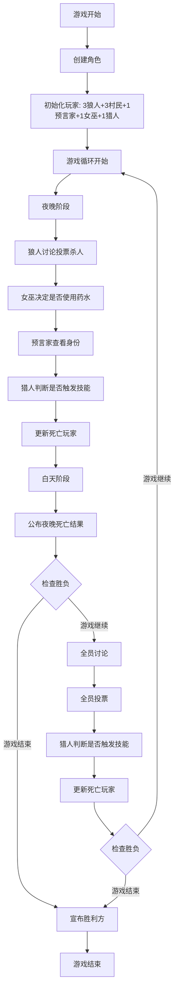
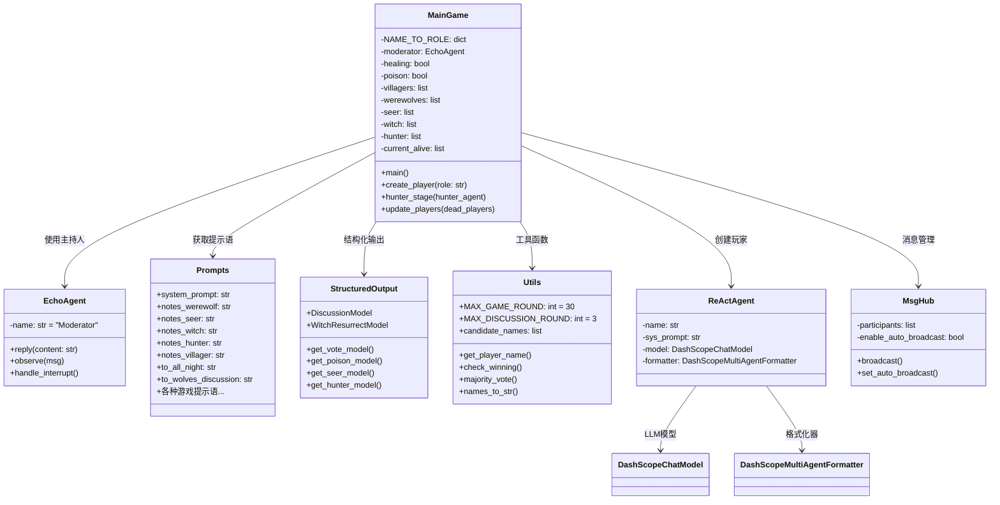
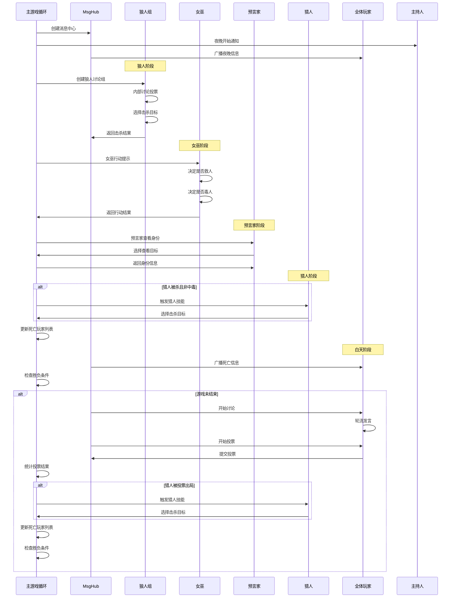
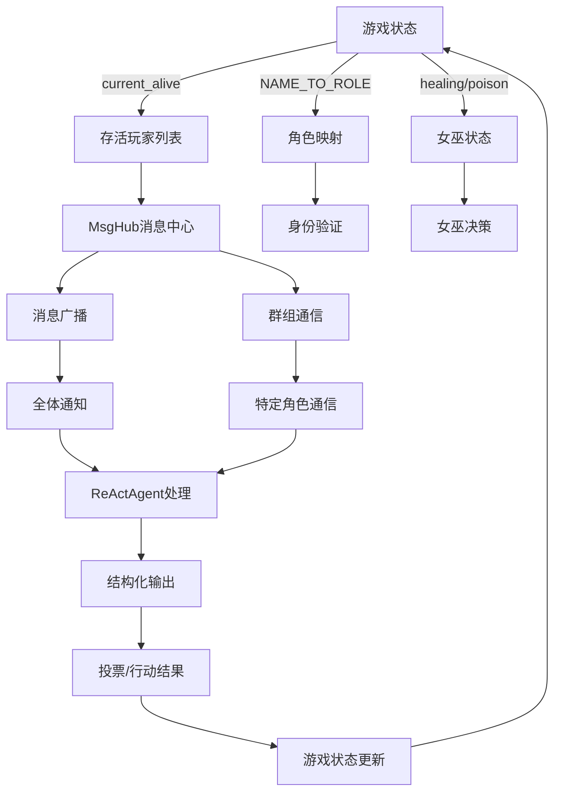

# 狼人杀游戏架构设计文档

## 概述

这是一个基于 AgentScope 框架实现的多智能体狼人杀游戏系统。游戏支持 9 个玩家（3个狼人、3个村民、1个预言家、1个女巫、1个猎人），通过大语言模型驱动的智能代理进行自动化游戏。

## 游戏角色配置

| 角色 | 数量 | 特殊能力 |
|-----|-----|----------|
| 狼人 | 3 | 每晚投票杀死一名玩家 |
| 村民 | 3 | 无特殊能力，通过投票淘汰狼人 |
| 预言家 | 1 | 每晚查看一名玩家的身份 |
| 女巫 | 1 | 拥有解药和毒药各一瓶 |
| 猎人 | 1 | 被淘汰时可以带走一名玩家 |

## 1. 游戏主流程图



## 2. 代码架构结构图



## 3. 组件交互序列图



## 4. 数据流向图



## 5. 核心代码结构分析

### 5.1 主游戏循环 (main.py)

```python
# 关键全局变量
NAME_TO_ROLE = {}  # 玩家名称到角色的映射
moderator = EchoAgent()  # 主持人代理
healing, poison = True, True  # 女巫药水状态
villagers, werewolves, seer, witch, hunter = [], [], [], [], []  # 角色分组
current_alive = []  # 当前存活玩家

# 核心函数结构
async def main():
    """主游戏入口"""
    # 1. 创建玩家
    # 2. 游戏循环 (最多30轮)
    #    a. 夜晚阶段
    #    b. 白天阶段
    #    c. 胜负判定

async def create_player(role: str) -> ReActAgent:
    """创建指定角色的玩家代理"""
    # 使用 DashScopeChatModel + ReActAgent

async def hunter_stage(hunter_agent) -> str | None:
    """猎人技能触发阶段"""
    # 可在夜晚或白天触发

def update_players(dead_players: list[str]) -> None:
    """更新游戏状态，移除死亡玩家"""
```

### 5.2 工具函数 (utils.py)

```python
# 游戏配置常量
MAX_GAME_ROUND = 30
MAX_DISCUSSION_ROUND = 3
candidate_names = ["Batman", "Superman", ...]  # 玩家名称池

# 核心工具函数
def get_player_name() -> str:
    """随机生成玩家名称"""

def check_winning(alive_agents, wolf_agents) -> str | None:
    """检查胜负条件"""
    # 狼人胜利: len(wolf_agents) * 2 >= len(alive_agents)
    # 村民胜利: not wolf_agents

def majority_vote(votes: list[str]) -> tuple:
    """多数票决定结果"""

class EchoAgent(AgentBase):
    """主持人代理，负责游戏信息广播"""
```

### 5.3 提示语系统 (prompt.py)

```python
class Prompts:
    """集中管理所有游戏提示语"""
    
    system_prompt = """基础系统提示..."""
    
    # 角色特定指导
    notes_werewolf = """狼人游戏指导..."""
    notes_seer = """预言家游戏指导..."""
    # ... 其他角色指导
    
    # 游戏阶段提示
    to_all_night = "夜晚开始..."
    to_wolves_discussion = "狼人讨论阶段..."
    # ... 其他阶段提示
```

### 5.4 结构化输出 (structured_output.py)

```python
from pydantic import BaseModel, Field

class DiscussionModel(BaseModel):
    """讨论阶段输出格式"""
    reach_agreement: bool = Field(description="是否达成一致")

def get_vote_model(agents) -> type[BaseModel]:
    """动态生成投票模型"""
    class VoteModel(BaseModel):
        vote: Literal[tuple(_.name for _ in agents)]
    return VoteModel

# 类似地定义其他角色的行动模型
# - WitchResurrectModel: 女巫救人
# - get_poison_model(): 女巫毒人
# - get_seer_model(): 预言家查看
# - get_hunter_model(): 猎人射击
```

## 6. 关键技术特点

### 6.1 异步编程模式
- 全程使用 `async/await` 处理并发操作
- 支持多个智能代理同时思考和响应
- 提高游戏进行效率

### 6.2 消息中心架构
- `MsgHub` 实现灵活的消息广播机制
- 支持全体广播和群组通信
- 可动态开启/关闭自动广播功能

### 6.3 结构化输出保证
- 使用 Pydantic 模型确保 AI 输出格式一致性
- 动态生成投票选项，防止无效选择
- 类型安全的游戏状态管理

### 6.4 管道模式处理
- `fanout_pipeline`: 并行处理（如同时投票）
- `sequential_pipeline`: 串行处理（如轮流发言）
- 提高游戏体验的自然性

### 6.5 智能代理系统
- **ReActAgent**: 基于思维链推理的智能代理
- **DashScope模型**: 集成阿里云大语言模型
- **多代理格式化**: 专门的对话格式处理

## 7. 游戏流程详解

### 7.1 初始化阶段
1. 创建 9 个智能代理，分配角色
2. 每个代理获得角色特定的系统提示
3. 按姓名排序确定发言顺序

### 7.2 夜晚阶段流程
1. **狼人阶段**：
   - 创建狼人专用消息群组
   - 狼人内部讨论（最多3轮*人数）
   - 投票选择击杀目标
   
2. **女巫阶段**：
   - 决定是否使用解药救人
   - 决定是否使用毒药杀人
   - 每种药水只能使用一次
   
3. **预言家阶段**：
   - 选择一名玩家查看身份
   - 获得该玩家的真实角色信息
   
4. **猎人阶段**：
   - 如果猎人被杀且不是中毒，触发反击
   - 选择一名玩家一起死亡

### 7.3 白天阶段流程
1. **结果公布**：宣布夜晚死亡情况
2. **胜负判定**：检查是否有阵营获胜
3. **自由讨论**：所有存活玩家轮流发言
4. **投票淘汰**：所有玩家投票选择淘汰对象
5. **猎人反击**：如果猎人被投票出局，可选择反击
6. **再次胜负判定**：检查游戏是否结束

### 7.4 胜负条件
- **狼人胜利**：狼人数量 ≥ 总存活人数的一半
- **村民胜利**：所有狼人被淘汰
- **游戏上限**：最多进行30轮，避免无限循环

## 8. 扩展可能性

### 8.1 角色扩展
- 可以添加新角色（如守卫、白痴等）
- 修改角色数量配置
- 自定义角色能力

### 8.2 AI 模型扩展
- 支持不同的大语言模型
- 可调整模型参数和提示策略
- 增加角色个性化设定

### 8.3 游戏机制扩展
- 添加更复杂的游戏规则
- 支持多局游戏和积分系统
- 增加观战和回放功能

## 9. 总结

这个狼人杀游戏展现了一个完整的多智能体游戏系统，通过清晰的职责分离、异步消息传递和结构化输出，成功实现了复杂的社交推理游戏。系统的模块化设计使得它具有良好的可扩展性和维护性。